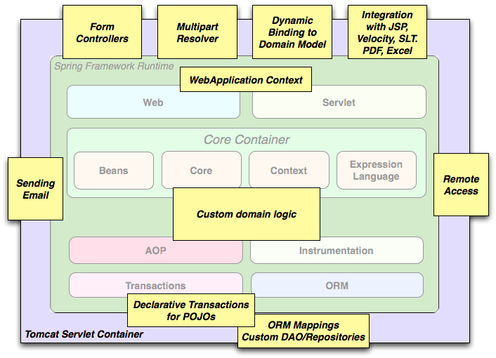

## 2.3 使用场景

Spring 是一个轻量级的框架，其各个模块之间没有很强的耦合性，而且可以集成其它开发框架，如 Hibernate、 Mybatis、JavaMail、 JMS、 JPA、 JNDI 等，它所提供的服务可以贯穿整个软件的各个层面。我们可以对这些服务灵活的选择搭配，用于各种开发场景，从受限设备的嵌入式应用到使用了事务管理功能和 Web 框架的完整企业级应用都能得到很好的支持。比如 Spring 的 IoC 容器是直接依赖 JVM 的，我们可以在 Java 环境中（如 Android）单独使用 Spring IoC 容器；再比如使用 Spring、 Spring MVC、 MyBatis 集成开发一个完整的企业级应用。

**图 2.2. Spring Web 典型应用的完整案例**

使用 Spring 的声明式事务管理特性可以使得 Web 应用具备完整的事务性。领域业务逻辑可以使用简单的 POJOs 实现，并由 Spring IoC 容器进行管理。其它的附加服务，如邮件、数据校验等可以独立于 Web 层，以便你灵活选择使用它们的位置。Spring 的 ORM 支持可以同时集成并使用 JPA、 Hibernate、 MyBatis 等 ORM 框架。表单控制器无缝整合了 Web 层和领域模型，从而无需进行从 HTTP 参数到领域模型转换的编码工作（如 `ActionForm`）。

**图 2.3. Spring 作中间层并使用第三方 Web 框架**

有时情况不允许你完全切换到不同的框架，比如一些历史应用程序。Spring 框架并不强制你在应用程序的所有方面都使用 Spring 的模块。比如使用 Struts、 Tapestry、 JSF 或其它 UI 框架构建的前端应用也可以与基于 Spring 的中间层集成，从而可以使用 Spring 的事务功能。你只需要使用 `ApplicationContext` 连接你的业务逻辑，并使用 `WebApplicationContext` 来集成你的 Web 层。

**Figure 2.4. 远程服务**

Spring 提供了多种远程访问技术的集成类。如 Hession(HessianProxyFactoryBean)、 RMI（RmiProxyFactoryBean） 以及 HTTP（HttpInvokerProxyFactoryBean）等。使你可以轻松的在现有应用中启用远程访问功能。

**Figure 2.5. EJBs - 封装已有 POJOs**

Spring 还为 Enterprise JavaBeans 提供了一个访问抽象层，使你可以重用已有的 POJOs，并将其封装在无状态会话 bean 中，以便你在可伸缩式安全故障的 Web 应用中使用声明式安全机制。
