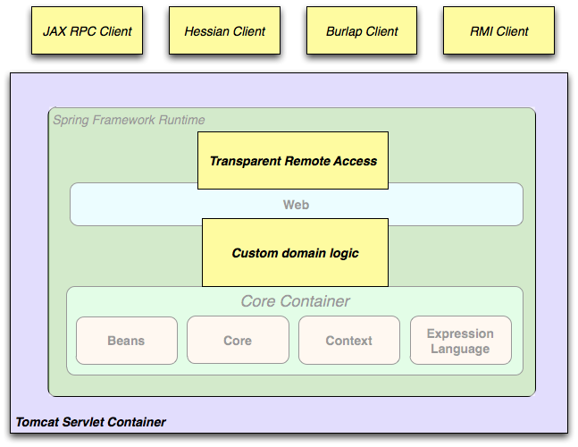

## 2.3 使用场景

Spring 是一个轻量级的框架，其各个模块之间没有很强的耦合性，而且可以集成其它开发框架，如 Hibernate、 Mybatis、JavaMail、 JMS、 JPA、 JNDI 等，它所提供的服务可以贯穿整个软件的各个层面。我们可以对这些服务灵活的选择搭配，用于各种开发场景，从受限设备的嵌入式应用到使用了事务管理功能和 Web 框架的完整企业级应用都能得到很好的支持。比如 Spring 的 IoC 容器是直接依赖 JVM 的，我们可以在 Java 环境中（如 Android）单独使用 Spring IoC 容器；再比如使用 Spring、 Spring MVC、 MyBatis 集成开发一个完整的企业级应用。

**图 2.2. Spring Web 典型应用的完整案例**

Spring 的声明式事务管理特性使 Web 应用可以具备完整的事务性，就像使用 EJB 容器管理事务一样。所有的自定义业务逻辑都可以使用简单的 POJOs 实现，并由 Spring IoC 容器进行管理。其它的附加服务包括邮件支持，以及独立于 Web 层的数据校验功能（可以让你选择执行校验的位置）。Spring 的 ORM 框架集成了 JPA 和 Hibernate，当使用 Hibernate 时， 可以继续使用已有的映射文件和标准的 Hibernate `SessionFactory` 配置。表单控制器无缝整合了 Web 层和领域模型，从而无需进行从 HTTP 参数到领域模型转换的处理（如 `ActionForm`）。

**Figure 2.3. Spring middle-tier using a third-party web framework**

  

Sometimes circumstances do not allow you to completely switch to a different framework. The Spring Framework does_not_force you to use everything within it; it is not an_all-or-nothing_solution. Existing front-ends built with Struts, Tapestry, JSF or other UI frameworks can be integrated with a Spring-based middle-tier, which allows you to use Spring transaction features. You simply need to wire up your business logic using an`ApplicationContext`and use a`WebApplicationContext`to integrate your web layer.

**Figure 2.4. Remoting usage scenario**

  

When you need to access existing code through web services, you can use Spring’s`Hessian-`,`Rmi-`or`HttpInvokerProxyFactoryBean`classes. Enabling remote access to existing applications is not difficult.

**Figure 2.5. EJBs - Wrapping existing POJOs**

  

The Spring Framework also provides an[access and abstraction layer](http://docs.spring.io/spring/docs/5.0.0.M4/spring-framework-reference/htmlsingle/#ejb)for Enterprise JavaBeans, enabling you to reuse your existing POJOs and wrap them in stateless session beans for use in scalable, fail-safe web applications that might need declarative security.

