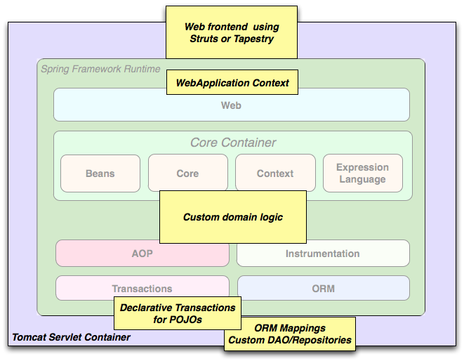
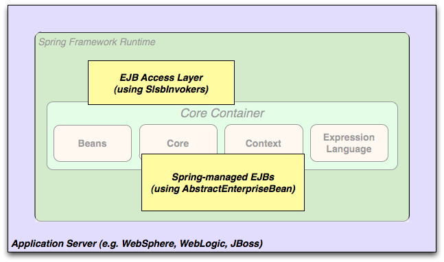

## 2.3 Usage scenarios

The building blocks described previously make Spring a logical choice in many scenarios, from embedded applications that run on resource-constrained devices to full-fledged enterprise applications that use Spring’s transaction management functionality and web framework integration.

**Figure 2.2. Typical full-fledged Spring web application**

  

Spring’s[declarative transaction management features](http://docs.spring.io/spring/docs/5.0.0.M4/spring-framework-reference/htmlsingle/#transaction-declarative)make the web application fully transactional, just as it would be if you used EJB container-managed transactions. All your custom business logic can be implemented with simple POJOs and managed by Spring’s IoC container. Additional services include support for sending email and validation that is independent of the web layer, which lets you choose where to execute validation rules. Spring’s ORM support is integrated with JPA and Hibernate; for example, when using Hibernate, you can continue to use your existing mapping files and standard Hibernate`SessionFactory`configuration. Form controllers seamlessly integrate the web-layer with the domain model, removing the need for`ActionForms`or other classes that transform HTTP parameters to values for your domain model.

**Figure 2.3. Spring middle-tier using a third-party web framework**

  

Sometimes circumstances do not allow you to completely switch to a different framework. The Spring Framework does_not_force you to use everything within it; it is not an_all-or-nothing_solution. Existing front-ends built with Struts, Tapestry, JSF or other UI frameworks can be integrated with a Spring-based middle-tier, which allows you to use Spring transaction features. You simply need to wire up your business logic using an`ApplicationContext`and use a`WebApplicationContext`to integrate your web layer.

**Figure 2.4. Remoting usage scenario**

  

When you need to access existing code through web services, you can use Spring’s`Hessian-`,`Rmi-`or`HttpInvokerProxyFactoryBean`classes. Enabling remote access to existing applications is not difficult.

**Figure 2.5. EJBs - Wrapping existing POJOs**

  

The Spring Framework also provides an[access and abstraction layer](http://docs.spring.io/spring/docs/5.0.0.M4/spring-framework-reference/htmlsingle/#ejb)for Enterprise JavaBeans, enabling you to reuse your existing POJOs and wrap them in stateless session beans for use in scalable, fail-safe web applications that might need declarative security.

